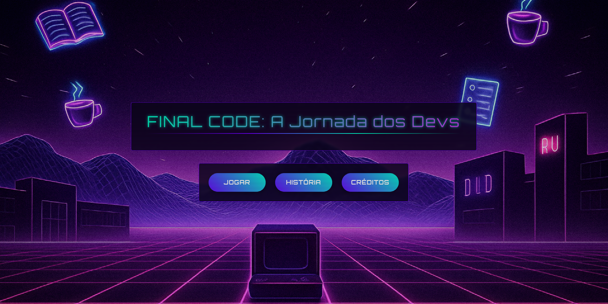

# 🎮 Final Code - A Jornada dos Devs



Um jogo de digitação divertido e desafiador onde você enfrenta professores como vilões digitando palavras rapidamente!

---

## 📖 Sobre o Jogo

**Final Code** é um jogo educativo de digitação que transforma professores em vilões épicos que você deve derrotar digitando palavras corretamente antes que elas desapareçam da tela.

---

## 🎯 Objetivo

- Digite as palavras que aparecem na tela antes que elas caiam  
- Derrote todos os professores/vilões para vencer o jogo  
- Alcance a maior pontuação possível  

---

## ✨ Funcionalidades

- **Sistema de Fases**: 4 fases principais + fase bônus  
- **Personagens Jogáveis**: 6 personagens diferentes para escolher  
- **Vilões Únicos**: Cada fase tem um professor/vilão diferente  
- **Sistema de Pontuação**: Ganhe pontos por palavras digitadas corretamente  
- **Efeitos Visuais**: Animações, partículas e feedback visual  
- **Sistema de Áudio**: Trilha sonora e efeitos sonoros  
- **Controles**: Teclado para digitação e atalhos úteis  

---

## 🕹️ Como Jogar

1. Escolha seu personagem na tela inicial  
2. Clique em **"Iniciar Jogo"**  
3. Digite as palavras que aparecem na tela  
4. Pressione **ENTER** para limpar a caixa de texto  
5. Pressione **ESC** para pausar o jogo  
6. Derrote todos os vilões para vencer!  

---

## 📊 Pontuação

- **Cada letra correta**: +1 ponto  
- **Palavra completa**: + bônus proporcional ao tamanho da palavra  
- **Erros ou palavras perdidas**: -1 vida  

---

## 🎭 Personagens e Vilões

### 👨‍🎓 Personagens Jogáveis

- Perin  
- Marcos  
- Andrezão  
- Gabe  
- Dig  
- Bernardo  

### 👹 Vilões/Professores

- **Cidão**, O Abominável... (mas nem tanto)  
- **Ferlini**, O Gostosinho...  
- **Hugo**, O Sr. Bootstrap...  
- **Moreno**, O Pequeno Grande Professor...  

*(Cada vilão tem sua própria história na tela de história do jogo)*

---

## 🛠️ Tecnologias Utilizadas

- Vue.js  
- JavaScript  
- HTML5  
- CSS3  
- Web Audio API  

---

## 📂 Estrutura do Projeto

```text
src/
├── App.vue                # Componente raiz do Vue
├── main.js                # Ponto de entrada da aplicação
├── assets/                # Recursos visuais e sonoros
│   ├── characters/        # Imagens dos personagens e vilões
│   ├── sounds/            # Efeitos sonoros e músicas
│   └── palavras.json      # Banco de palavras do jogo
├── components/            # Componentes reutilizáveis
│   ├── TelaInicial.vue    # Tela inicial
│   ├── TelaHistoria.vue   # Tela de história
│   ├── TelaJogo.vue       # Tela principal do jogo
│   └── TelaCreditos.vue   # Tela de créditos
```

---

## 🎨 Design e Estilo

- Interface moderna com efeitos de partículas  
- Cores vibrantes com gradientes  
- Animações suaves  
- Design responsivo para diferentes tamanhos de tela  

---

## 🎵 Trilha Sonora

- Música tema para cada fase  
- Efeitos sonoros para acertos, erros e eventos do jogo  

---

## 🚀 Como Executar

1. Clone o repositório  
2. Instale as dependências:  
   ```bash
   npm install
3. Execute o projeto:
    ```bash
   npm run dev
4. [Acesse no navegador](http://localhost:8080)

## 📜 Créditos

- Desenvolvido pelos alunos:
    ```text
    - André Augusto Silva Domingues
    - André Perin Geraldo
    - Bernardo Fiorese Perly
    - Gabriel de Souza Carvalho
    - Marcos Vinicius de Azevedo Batista
    - Heitor Henrique Scramim de Freitas
    ```

- Músicas por:

